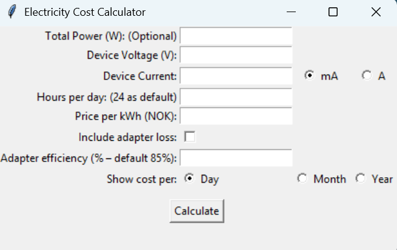

**Electricity Cost Calculator** is a simple desktop app built with Python and Tkinter that helps you calculate the electricity cost of any device.

**Features**

--Enter either total power (W) or device voltage and current

--Include adapter efficiency to account for energy losses

--Calculate electricity cost per day, month, or year

--Customizable electricity price (NOK or any other currency)

--Friendly GUI for quick calculations

**Installation**
Download and run the exe-file:

Electricity_and_Cost_Calculator.exe

**Usage**

1. Enter the device information (ususally found on the charger or adapter) and the electricity price.  
2. If "total power consumption" is listed on the device, it is recommended to use it. Voltage/current field will be deactivated. 
3. If a field has a default value and you wish to keep it, you can leave it empty.  
4. Click **Calculate** to see the electricity cost.  
5. Choose between daily, monthly, or yearly cost for the results.

**About**

This app is perfect for homeowners, hobbyists, or anyone who wants to track and reduce energy costs.
